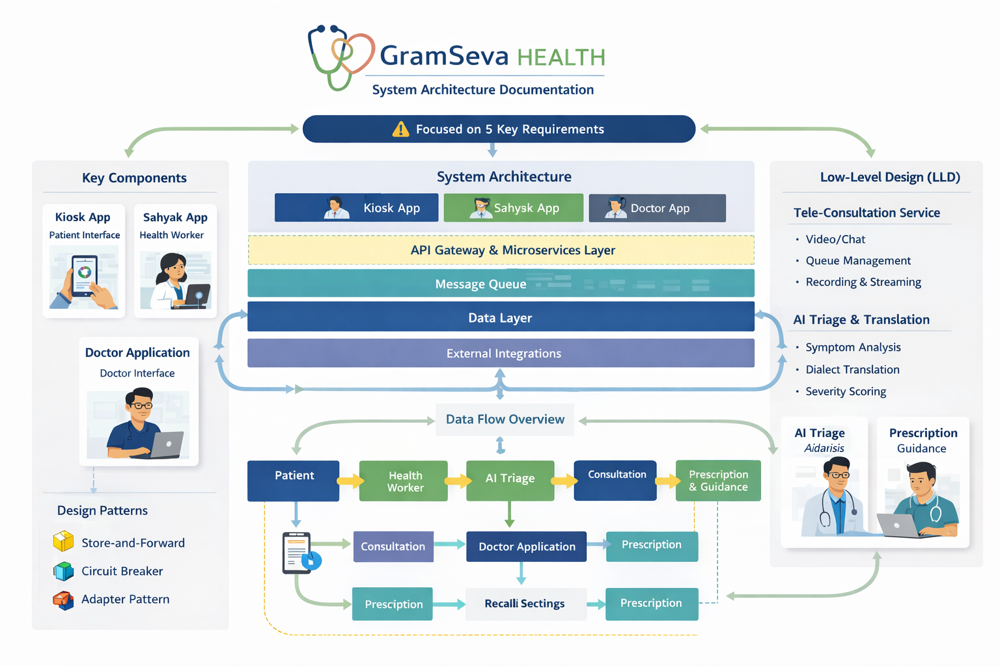
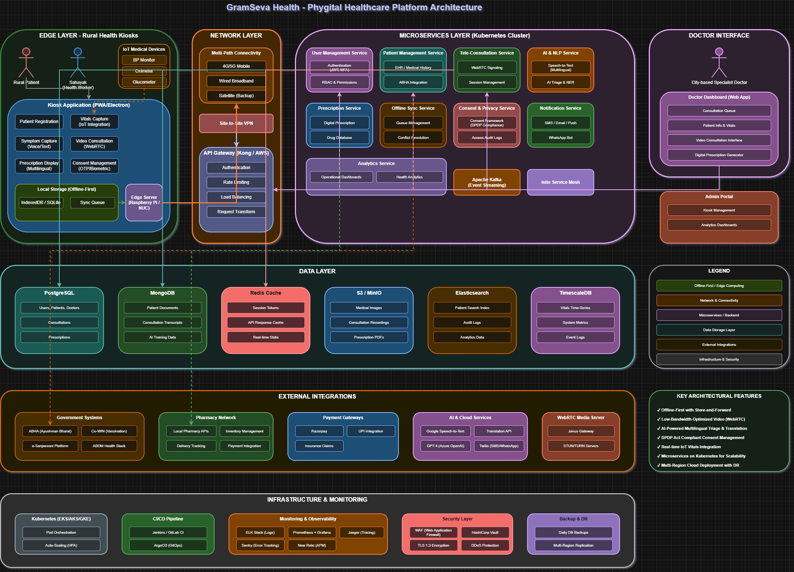
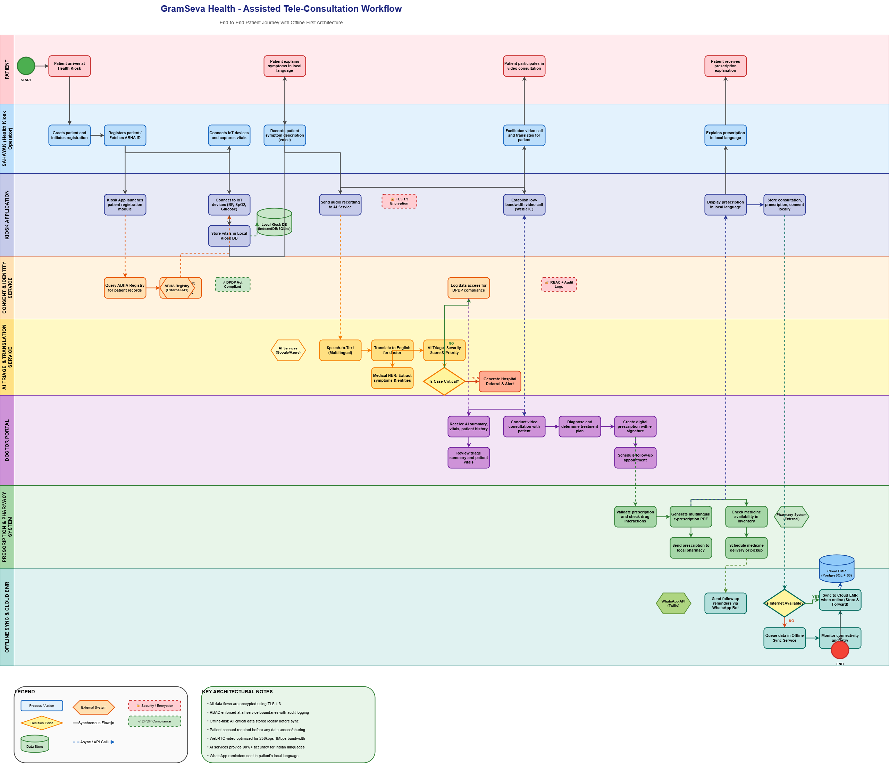

# GramSeva Health - Architecture Documentation

## 📋 Quick Navigation
- [Architecture Overview](#architecture-overview)
- [Data Flow](#data-flow-architecture)
- [System Components](#system-components-architecture)
- [Detailed Documentation](docs/)
  - [Architecture Details](docs/ARCHITECTURE.md)
  - [Business Perspective](docs/BUSINESS_PERSPECTIVE.md)
  - [Design Patterns](docs/DESIGN_PATTERNS_SUMMARY.md)
  - [Features](docs/FEATURES.md)
  - [Requirements](docs/KEY_REQUIREMENTS.md)

---

## Executive Summary

GramSeva Health is a **"Phygital"** (Physical + Digital) healthcare platform designed to bridge the healthcare gap between rural patients and city-based medical specialists. The system enables assisted tele-consultations through local Health Kiosks operated by trained intermediaries called **Sahayaks**, eliminating unnecessary travel for rural patients while ensuring quality healthcare delivery.

### Key Metrics
- 🎯 **Target**: 10,000+ kiosks across rural India
- 👥 **Users**: Patients, Sahayaks, Doctors, Pharmacists, Admins
- 🌐 **Languages**: 15+ Indian regional languages
- 📱 **Offline-First**: Works with intermittent connectivity
- 🔒 **Compliance**: DPDP Act, ABDM standards

---

## Architecture Overview

### High-Level Design


### System Design


### Implementation Flow


---

## 1. Business Context and Objectives

### 1.1 Problem Statement
Rural patients lack access to quality healthcare specialists, forcing them to travel long distances even for non-critical consultations. Language barriers, lack of digital literacy, and poor internet connectivity further compound these challenges.

### 1.2 Business Objectives
- **Reduce Patient Travel Burden**: Filter non-critical cases through remote consultation, minimizing unnecessary travel
- **Empower Health Workers**: Equip Sahayaks with digital tools to capture accurate vitals and patient history
- **Overcome Language Barriers**: Bridge communication gaps in medical diagnosis and prescription understanding
- **Ensure Care Continuity**: Provide ongoing care for chronic conditions like diabetes and hypertension prevalent in rural India

### 1.3 Target Users
1. **Patients**: Rural population with limited access to specialists
2. **Sahayaks**: Trained local health intermediaries operating kiosks
3. **Doctors**: City-based medical specialists providing remote consultations
4. **Pharmacists**: Local pharmacy partners for medicine fulfillment
5. **Administrators**: Platform managers and health coordinators

---

## 2. Data Flow Architecture

### End-to-End Consultation Flow


### Key Data Flow Stages

1. **Patient Registration** → Kiosk captures demographics and ABHA ID
2. **Vitals Collection** → IoT devices sync real-time health data
3. **Symptom Capture** → Voice/text recording in local language
4. **AI Triage** → ML model analyzes symptoms and assigns priority
5. **Video Consultation** → WebRTC connection between Sahayak/Patient and Doctor
6. **Prescription Generation** → Doctor creates multilingual digital prescription
7. **Pharmacy Integration** → Auto-forwarded to local pharmacy
8. **Follow-up Scheduling** → Appointment booking for chronic care

### Offline-First Sync Mechanism

.png)

**Sync Strategy:**
- Local IndexedDB stores consultation data
- Background sync when connectivity available
- Priority queue: Critical vitals > Prescriptions > Symptom recordings
- Conflict resolution using last-write-wins with timestamp

---

## 3. High-Level Architecture Overview

### 2.1 Architecture Principles
- **Offline-First Design**: Must function with intermittent internet connectivity
- **Low-Bandwidth Optimization**: Optimized for rural network conditions (adaptive bitrate 256kbps-1Mbps)
- **Multilingual Support**: Support for local dialects and regional languages
- **Privacy by Design**: DPDP Act compliance with explicit consent management
- **Scalability**: Handle growing network of kiosks and consultations
- **Interoperability**: Integration with government health systems (ABHA, CoWIN) and local pharmacies

### 2.2 Architecture Style
**Hybrid Architecture**: Microservices-based cloud backend with edge computing capabilities at kiosk locations

**Key Patterns:**
- Event-Driven Architecture for async operations
- Store-and-Forward for offline resilience
- API Gateway for unified access
- CQRS for read/write optimization
- Circuit Breaker for external integrations

### 2.3 Component Interaction Diagram

.png)

---

## Technology Stack Overview

### Frontend Technologies
```
┌─────────────────────────────────────────────────────┐
│  Kiosk App: React/Vue.js + PWA + WebRTC            │
│  Doctor Portal: React/Angular SPA                   │
│  Admin Portal: React + Dashboard Framework          │
│  Offline: IndexedDB + Service Workers + Workbox    │
└─────────────────────────────────────────────────────┘
```

### Backend Services
```
┌─────────────────────────────────────────────────────┐
│  Languages: Node.js, Python, Java Spring Boot       │
│  API Gateway: Kong/AWS API Gateway                  │
│  Message Queue: Apache Kafka + RabbitMQ             │
│  Cache: Redis                                       │
│  WebRTC: Janus Gateway/Mediasoup                   │
└─────────────────────────────────────────────────────┘
```

### Data & Storage
```
┌─────────────────────────────────────────────────────┐
│  RDBMS: PostgreSQL (User, Consultation, Rx)        │
│  NoSQL: MongoDB (Documents, Unstructured)          │
│  Storage: AWS S3/MinIO (Media, Videos, PDFs)       │
│  Search: Elasticsearch (Medical Records)           │
│  Analytics: ClickHouse + Apache Superset           │
└─────────────────────────────────────────────────────┘
```

### AI/ML & Integration
```
┌─────────────────────────────────────────────────────┐
│  NLP: Google Speech-to-Text, BioBERT, GPT-4        │
│  ML: TensorFlow/PyTorch (Triage Models)            │
│  ABHA: Government Health Stack Integration         │
│  Pharmacy: WhatsApp Business API                   │
└─────────────────────────────────────────────────────┘
```

---

## 4. System Components Architecture

### Components Overview
```
┌─────────────────────────────────────────────────────────────┐
│                     FRONTEND LAYER                           │
├─────────────────────────────────────────────────────────────┤
│  • Kiosk App (PWA) - Patient Registration + IoT Integration │
│  • Doctor Portal - Consultation Dashboard + Prescription    │
│  • Admin Portal - Analytics + Kiosk Management              │
└─────────────────────────────────────────────────────────────┘
                              ↓
┌─────────────────────────────────────────────────────────────┐
│                   API GATEWAY (Kong)                         │
└─────────────────────────────────────────────────────────────┘
                              ↓
┌─────────────────────────────────────────────────────────────┐
│                  MICROSERVICES LAYER                         │
├─────────────────────────────────────────────────────────────┤
│  [User Mgmt] [Patient Mgmt] [Consultation] [AI/NLP]        │
│  [Prescription] [Notification] [Analytics] [Sync Service]   │
└─────────────────────────────────────────────────────────────┘
                              ↓
┌─────────────────────────────────────────────────────────────┐
│                      DATA LAYER                              │
├─────────────────────────────────────────────────────────────┤
│  [PostgreSQL] [MongoDB] [Redis] [S3] [Elasticsearch]       │
└─────────────────────────────────────────────────────────────┘
                              ↓
┌─────────────────────────────────────────────────────────────┐
│                 EXTERNAL INTEGRATIONS                        │
├─────────────────────────────────────────────────────────────┤
│  • ABHA (Health Records)  • Payment Gateway                 │
│  • Pharmacy APIs          • SMS/WhatsApp                    │
│  • Government Systems     • IoT Device Protocols            │
└─────────────────────────────────────────────────────────────┘
```

> 📚 **For detailed implementation steps**, refer to the [complete architecture documentation](docs/ARCHITECTURE.md)

### 4.1 Frontend Layer - Key Features

#### 4.1.1 Kiosk Application (Sahayak Interface)
**Tech Stack:** PWA, React/Vue.js, WebRTC, IndexedDB, Service Workers

**Core Modules:**
1. **Patient Registration** - ABHA ID integration, offline-capable
2. **IoT Device Integration** - BP, SpO2, Glucose monitors via Bluetooth
3. **Symptom Capture** - Voice (60-120s) in local dialect + text checklist
4. **Video Consultation** - WebRTC (256kbps-1Mbps adaptive)
5. **Prescription Display** - Multilingual with text-to-speech
6. **Offline Sync** - Priority queue with background sync

#### 4.1.2 Doctor Dashboard
**Tech Stack:** React/Angular SPA, WebRTC, WebSocket

**Core Features:**
- **Queue Management** - AI-prioritized patient list
- **Patient Info** - Real-time vitals + AI-generated summary
- **Video Consultation** - HD calls with annotation tools
- **Prescription Generator** - Drug database with interaction checker
- **Follow-up Scheduling** - Chronic care management

#### 4.1.3 Admin Portal
- Kiosk & Sahayak management
- Doctor panel onboarding
- Analytics dashboards
- Audit logs & compliance reports

---

### 4.2 Backend Microservices

> 📖 **Detailed implementation steps** available in [Architecture Documentation](docs/ARCHITECTURE.md)

| Service | Responsibility | Tech Stack |
|---------|---------------|------------|
| **User Management** | Auth, RBAC, Profiles | Node.js, PostgreSQL, Redis, JWT |
| **Patient Management** | EHR, ABHA Integration | Spring Boot, PostgreSQL, MongoDB |
| **Consultation Service** | Video calls, Sessions | Node.js, WebRTC, Kafka |
| **AI/NLP Service** | STT, Translation, Triage | Python, TensorFlow, BioBERT |
| **Prescription Service** | Rx generation, Pharmacy | Node.js, PostgreSQL, WhatsApp API |
| **Notification Service** | SMS, Email, WhatsApp | Node.js, Twilio, Firebase |
| **Analytics Service** | Reports, Dashboards | Python, ClickHouse, Superset |
| **Offline Sync Service** | Delta sync, Conflict resolution | Node.js, Redis, PostgreSQL |

---

### 4.3 Data Architecture

#### Database Strategy
```
PostgreSQL (RDBMS)           MongoDB (NoSQL)           S3/MinIO (Object Store)
├── Users & Auth             ├── Patient Documents     ├── Medical Images
├── Patients & EHR           ├── Consultation Trans.   ├── Video Recordings
├── Consultations            ├── Training Data         ├── Prescription PDFs
├── Prescriptions            └── Unstructured Data     └── Backups
└── Audit Logs

Redis (Cache)                Elasticsearch             Kafka (Event Stream)
├── Sessions                 ├── Medical Records       ├── Consultation Events
├── Real-time Vitals         ├── Search Index          ├── Notification Queue
└── Sync Queue               └── Full-text Search      └── Analytics Pipeline
```

---

## 5. Key Workflows

### Workflow 1: Complete Consultation Journey

```
Patient Arrival → Sahayak Login → Patient Registration/Lookup
        ↓
IoT Device Connection → Vitals Capture (BP, SpO2, Temp, Glucose)
        ↓
Symptom Recording (Voice in local language) → Text Checklist
        ↓
AI Processing (STT → Translation → NER → Triage Score)
        ↓
Doctor Queue Assignment (Priority-based) → Notification
        ↓
Video Consultation Start (WebRTC) → Real-time Vitals Display
        ↓
Doctor Diagnosis → Digital Prescription (Multilingual)
        ↓
Prescription to Pharmacy (WhatsApp) + Patient (SMS/Print)
        ↓
Follow-up Scheduled (if chronic) → Payment Collection
        ↓
Consultation Close → Data Sync to Cloud → Analytics Update
```

### Workflow 2: Offline Consultation Sync

```
Offline Mode Active → Patient Data Stored in IndexedDB
        ↓
Vitals + Symptoms + Photos Queued Locally
        ↓
Network Detection → Connectivity Restored
        ↓
Background Sync Triggered → Priority Queue Processing
        ↓
Critical Vitals First → Prescriptions → Media Files
        ↓
Conflict Detection → Timestamp-based Resolution
        ↓
Sync Complete → Local Data Marked as Synced
```

---

## 6. Security & Compliance

### Data Privacy (DPDP Act Compliance)
- ✅ Explicit consent for data collection, storage, sharing
- ✅ Purpose limitation (consultation, analytics, research)
- ✅ Data minimization (collect only necessary info)
- ✅ Right to access, correction, deletion
- ✅ Consent withdrawal mechanism
- ✅ Breach notification within 72 hours

### Security Measures
```
┌────────────────────────────────────────────────────┐
│ Transport Layer    │ TLS 1.3 encryption           │
├────────────────────────────────────────────────────┤
│ Application Layer  │ JWT tokens, API rate limiting│
├────────────────────────────────────────────────────┤
│ Data Layer         │ AES-256 at rest encryption   │
├────────────────────────────────────────────────────┤
│ Network Layer      │ VPC, Security Groups, WAF    │
├────────────────────────────────────────────────────┤
│ Access Control     │ RBAC, MFA, Session timeout   │
└────────────────────────────────────────────────────┘
```

### Compliance Standards
- 🏥 **ABDM (Ayushman Bharat Digital Mission)** - Health data exchange standards
- 🔒 **DPDP Act 2023** - Personal data protection
- 📋 **HL7 FHIR** - Health information interoperability
- 🌐 **HIPAA-like practices** - Privacy & security best practices

---

## 7. Scalability & Performance

### Performance Targets
| Metric | Target | Strategy |
|--------|--------|----------|
| **API Response Time** | < 200ms (P95) | Redis caching, CDN |
| **Video Call Latency** | < 150ms | Regional TURN servers |
| **Offline Sync** | < 30s for critical data | Priority queue |
| **Concurrent Users** | 100K+ | Horizontal scaling |
| **Database Queries** | < 50ms | Indexing, partitioning |
| **Uptime** | 99.9% | Multi-region deployment |

### Scaling Strategy
```
Horizontal Scaling              Load Balancing           Auto-Scaling
├── Stateless services          ├── NGINX/HAProxy       ├── Kubernetes HPA
├── Database read replicas      ├── Round-robin DNS     ├── AWS Auto Scaling
├── Kafka partitioning          └── Health checks       └── Metric-based scaling
└── S3 multi-region
```

---

## 8. Deployment Architecture

### Cloud Infrastructure (AWS/Azure/GCP)
```
┌─────────────────────────────────────────────────────┐
│              Multi-Region Deployment                 │
├─────────────────────────────────────────────────────┤
│  Region 1 (Primary)      │  Region 2 (DR)           │
│  ├── EKS/AKS Cluster     │  ├── Standby Cluster     │
│  ├── RDS PostgreSQL      │  ├── Read Replica        │
│  ├── ElastiCache Redis   │  ├── Redis Replica       │
│  └── S3 Bucket           │  └── S3 Cross-region rep │
└─────────────────────────────────────────────────────┘
         ↓                          ↓
    CloudFront CDN          Route 53 (Failover)
```

### Container Orchestration (Kubernetes)
- **Services**: Each microservice as separate deployment
- **Auto-scaling**: HPA based on CPU/Memory
- **Service Mesh**: Istio for traffic management
- **Monitoring**: Prometheus + Grafana
- **Logging**: ELK Stack (Elasticsearch, Logstash, Kibana)

---

## 9. Monitoring & Observability

### Monitoring Stack
```
Application Metrics (Prometheus)
├── API request rates
├── Error rates (4xx, 5xx)
├── Response times (P50, P95, P99)
└── Service dependencies

Infrastructure Metrics (CloudWatch/Azure Monitor)
├── CPU, Memory, Disk usage
├── Network throughput
└── Database connections

Business Metrics (Custom Dashboards)
├── Consultations per day
├── Average wait time
├── Prescription fulfillment rate
└── Patient satisfaction scores
```

### Alerts & Incident Response
- 🚨 **Critical**: Page on-call engineer (API down, DB failure)
- ⚠️ **Warning**: Slack notification (high latency, errors)
- 📊 **Info**: Email digest (daily metrics summary)

---

## 10. Future Enhancements

### Phase 2 (6-12 months)
- 🤖 **AI Symptom Checker** - Chatbot for preliminary diagnosis
- 📱 **Mobile App** - Direct patient access (post-consultation)
- 🏥 **Hospital Integration** - Referral management to tertiary care
- 💊 **Medicine Delivery** - Integration with e-pharmacy platforms

### Phase 3 (12-24 months)
- 🧬 **Lab Integration** - Sample collection at kiosks
- 🩺 **Remote Monitoring** - Home IoT devices for chronic patients
- 📊 **Predictive Analytics** - Disease outbreak detection
- 🌍 **International Expansion** - Africa, Southeast Asia markets

---

## 📚 Additional Resources

### Documentation
- 📖 [Complete Architecture Document](docs/ARCHITECTURE.md) - Detailed implementation guide
- 💼 [Business Perspective](docs/BUSINESS_PERSPECTIVE.md) - Business context and stakeholders
- 🎨 [Design Patterns](docs/DESIGN_PATTERNS_SUMMARY.md) - Architecture patterns used
- ✨ [Features Breakdown](docs/FEATURES.md) - Feature-wise implementation
- 📋 [Requirements](docs/KEY_REQUIREMENTS.md) - Functional & non-functional requirements

### Diagrams
- 🗂️ [Data Flow Diagrams](draw_io_diagrams/) - Visual data flow representations
- 🏗️ [Architecture Diagrams](draw_io_diagrams/) - High-level and detailed designs

---

## API Quick Reference

### Core Endpoints

**Authentication**
- `POST /api/v1/auth/login` - User login
- `POST /api/v1/auth/refresh` - Refresh JWT token
- `POST /api/v1/auth/mfa/verify` - MFA verification

**Patient Management**
- `POST /api/v1/patients` - Register new patient
- `GET /api/v1/patients/{id}` - Get patient details
- `GET /api/v1/patients/{id}/history` - Medical history
- `POST /api/v1/patients/{id}/consent` - Record consent

**Consultation**
- `POST /api/v1/consultations` - Create consultation
- `POST /api/v1/consultations/{id}/vitals` - Upload vitals
- `POST /api/v1/consultations/{id}/symptoms` - Upload symptoms
- `GET /api/v1/consultations/{id}/triage` - Get AI triage

**Prescription**
- `POST /api/v1/prescriptions` - Create prescription
- `GET /api/v1/prescriptions/{id}/pdf` - Download PDF
- `POST /api/v1/prescriptions/{id}/fulfill` - Send to pharmacy

---

## ⚙️ Implementation Guide

For detailed implementation steps including:
- Microservices architecture details
- Database schemas and data models
- Infrastructure setup and deployment
- Security configurations
- Performance tuning

**Please refer to**: [Complete Architecture Documentation](docs/ARCHITECTURE.md)

---

**Document Version**: 1.0  
**Last Updated**: January 15, 2026  
**Repository**: [github.com/patilanupam/GramSeva_Architecture_Kata](https://github.com/patilanupam/GramSeva_Architecture_Kata)  
**Status**: Ready for Review

---

### Appendix: Legacy Implementation Notes

**Step 1: Patient Registration**
- Create patient records with unique IDs
- ABHA ID integration via government APIs
- Demographic data validation
- Duplicate detection using fuzzy matching
- Family linking for household records

**Step 2: Medical History Management**
- Electronic Health Records (EHR) storage
- Structured data storage (conditions, medications, allergies)
- Document repository (PDFs, images)
- Version control for records
- Data export in standard formats (HL7 FHIR)

**Step 3: Chronic Condition Tracking**
- Disease registries (diabetes, hypertension, etc.)
- Trend analysis for vitals over time
- Alert generation for abnormal readings
- Care pathway templates
- Medication adherence tracking

**Step 4: ABHA Integration**
- Fetch patient records from ABHA network
- Sync local records to ABHA (with consent)
- Insurance eligibility verification
- Scheme benefit checks
- Interoperability with other healthcare systems

**Technology Stack:**
- Node.js/Java Spring Boot
- PostgreSQL for structured data
- MongoDB for unstructured documents
- S3/MinIO for file storage
- FHIR server for health data interoperability

#### 3.2.3 Tele-Consultation Service
**Responsibilities:** Video call orchestration, consultation workflow, recording management

**Detailed Implementation Steps:**

**Step 1: Video Call Infrastructure**
- WebRTC signaling server setup
  - Use Janus Gateway or Mediasoup
  - STUN/TURN server configuration for NAT traversal
  - Bandwidth estimation and adaptive streaming
- Video quality presets (low, medium, high)
- Audio codec optimization (Opus)
- Network quality monitoring
- Automatic fallback to audio-only

**Step 2: Consultation Session Management**
- Create consultation session with unique ID
- Real-time status updates (waiting, active, completed)
- Participant tracking (Sahayak, Doctor, Patient)
- Session timeout management
- Reconnection handling for dropped connections

**Step 3: Consultation Recording (Optional)**
- Video/audio stream recording with consent
- Cloud storage with encryption at rest
- Retention policy enforcement
- Access controls for recorded sessions
- Playback interface for review

**Step 4: Real-Time Vitals Streaming**
- WebSocket connection for live IoT data
- Data buffering and transmission
- Visualization on doctor dashboard
- Alert generation for critical values
- Historical data overlay

**Step 5: Chat and Collaboration**
- Real-time text chat via WebSocket
- File sharing during consultation
- Screen sharing capability
- Annotation and markup tools
- Chat history persistence

**Technology Stack:**
- Node.js for signaling server
- Janus/Mediasoup for WebRTC media server
- Redis for real-time session state
- Kafka for event streaming
- S3 for recording storage

#### 3.2.4 AI & NLP Service
**Responsibilities:** Speech-to-text, translation, medical entity extraction, triage scoring

**Detailed Implementation Steps:**

**Step 1: Speech Recognition (Multilingual)**
- Integrate speech-to-text APIs
  - Google Cloud Speech-to-Text (supports 125+ languages)
  - Azure Speech Services
  - Open-source: Whisper, Vosk for local deployment
- Support for regional Indian languages (Hindi, Tamil, Telugu, Bengali, Marathi, etc.)
- Noise cancellation and audio preprocessing
- Confidence scoring for transcription
- Manual correction interface for Sahayaks

**Step 2: Language Translation**
- Translation from local language to English
- Medical terminology preservation
- Context-aware translation using NMT (Neural Machine Translation)
- Google Translate API or custom models
- Post-editing for accuracy

**Step 3: Medical Entity Recognition (NER)**
- Extract symptoms, body parts, severity indicators
- Use pre-trained biomedical models (BioBERT, Clinical BERT)
- Custom entity recognition for Indian medical context
- Relationship extraction (symptom-disease mapping)
- Standardization to medical codes (ICD-10, SNOMED CT)

**Step 4: Triage and Severity Scoring**
- AI model for preliminary severity assessment
  - Input: Symptoms, vitals, patient history
  - Output: Severity score (1-10) + recommended urgency
- Rule-based red flags (chest pain, difficulty breathing, etc.)
- Machine learning model trained on historical consultation data
- Explainable AI for transparency
- Continuous model retraining

**Step 5: Medical Summarization**
- Generate structured medical summary from symptom narrative
- Chief complaint extraction
- History of present illness (HPI) generation
- Review of systems (ROS) documentation
- GPT-4 or domain-specific summarization models

**Technology Stack:**
- Python (FastAPI/Flask)
- TensorFlow/PyTorch for ML models
- Hugging Face Transformers
- Google Cloud AI / Azure Cognitive Services
- PostgreSQL for medical knowledge base
- Vector database (Pinecone, Weaviate) for semantic search

#### 3.2.5 Prescription Management Service
**Responsibilities:** Digital prescription generation, drug database, pharmacy integration

**Detailed Implementation Steps:**

**Step 1: Prescription Creation**
- Structured prescription data model
  - Patient info, doctor info, consultation date
  - Medications (name, dosage, frequency, duration)
  - Instructions and precautions
  - Follow-up recommendations
- Template management for common prescriptions
- Drug interaction checking against patient history
- Allergy cross-checking
- Dosage validation (age, weight-based)

**Step 2: Drug Database Management**
- Comprehensive medicine catalog
  - Generic and brand names
  - Composition, manufacturer
  - Available forms (tablet, syrup, injection)
  - Pricing information
  - Alternatives/substitutes
- Integration with public drug databases
- Search with autocomplete
- Drug classification (antibiotic, analgesic, etc.)

**Step 3: Multilingual Prescription Generation**
- Convert prescription to patient's local language
- Include medicine images for easy identification
- Dosage instructions in simple language
- Visual dosage calendar (morning, afternoon, evening)
- QR code for digital verification

**Step 4: E-Signature and Validation**
- Doctor digital signature with certificate
- Prescription unique ID and verification system
- Tamper-proof PDF generation with watermark
- Blockchain-based prescription registry (optional)
- Verification API for pharmacies

**Step 5: Pharmacy Integration**
- Send prescription to selected local pharmacy
- Medicine availability check
- Order placement and tracking
- Delivery coordination
- Payment integration

**Technology Stack:**
- Node.js/Java Spring Boot
- PostgreSQL for drug database
- Redis for caching frequently prescribed drugs
- PDF generation libraries (PDFKit, wkhtmltopdf)
- Digital signature libraries (DocuSign API, OpenSSL)

#### 3.2.6 Offline Sync Service
**Responsibilities:** Data synchronization, conflict resolution, queue management

**Detailed Implementation Steps:**

**Step 1: Sync Queue Management**
- Priority-based sync queue
  - P0: Critical medical data (vitals, prescriptions)
  - P1: Consultation records
  - P2: Documents, images
  - P3: Analytics data
- Persistent queue storage (RabbitMQ, Kafka)
- Retry mechanism with exponential backoff
- Failed sync error handling and notification

**Step 2: Data Conflict Resolution**
- Timestamp-based conflict detection
- Conflict resolution strategies:
  - Last-write-wins for simple data
  - Merge strategy for complex objects
  - Manual review queue for critical conflicts
- Audit trail for all conflict resolutions
- Rollback capability

**Step 3: Delta Sync Optimization**
- Change tracking at field level
- Only sync modified data
- Data compression before transmission
- Chunking for large files
- Bandwidth-aware sync scheduling

**Step 4: Offline Capability Management**
- Local database replication
- Read-only mode during extended offline periods
- Offline operation logging
- Sync status dashboard
- Network quality monitoring

**Technology Stack:**
- Node.js/Go
- PostgreSQL with replication
- Redis for sync state
- Apache Kafka for event streaming
- CouchDB/PouchDB for offline-first database

#### 3.2.7 Consent & Privacy Service
**Responsibilities:** DPDP Act compliance, consent management, data access control

**Detailed Implementation Steps:**

**Step 1: Consent Management Framework**
- Granular consent collection
  - Purpose-specific consent (consultation, data sharing, research)
  - Consent expiry and renewal
  - Withdrawal mechanism
- Digital consent recording with audit trail
- OTP/Biometric verification for consent
- Consent dashboard for patients

**Step 2: Data Access Logging**
- Log all data access events
  - Who accessed what data, when, and why
  - IP address and device information
  - Duration of access
- Real-time monitoring dashboard
- Anomaly detection for unauthorized access
- Compliance reports generation

**Step 3: Data Anonymization & Pseudonymization**
- Anonymize data for analytics and research
- Pseudonymization for non-essential access
- Tokenization of sensitive identifiers
- De-identification techniques
- Re-identification risk assessment

**Step 4: Right to Data Portability**
- Export patient data in machine-readable format
- FHIR-compliant data export
- Automated export request processing
- Secure data transfer mechanisms
- Data deletion on request (Right to be Forgotten)

**Step 5: Role-Based Data Masking**
- Field-level access control
- Dynamic data masking based on roles
- Temporary access grants with expiry
- Break-glass access for emergencies
- Audit trail for all exceptions

**Technology Stack:**
- Node.js/Java Spring Boot
- PostgreSQL with row-level security
- HashiCorp Vault for secrets management
- Blockchain for immutable consent logs (optional)
- Apache Ranger for data governance

#### 3.2.8 Notification Service
**Responsibilities:** Multi-channel notifications, reminders, alerts

**Detailed Implementation Steps:**

**Step 1: Notification Channels**
- SMS notifications via Twilio/SNS
- Email notifications
- Push notifications to mobile apps
- WhatsApp Business API integration
- In-app notifications

**Step 2: Notification Types**
- Appointment reminders
- Medication adherence reminders
- Follow-up appointment alerts
- Critical lab result notifications
- System alerts for Sahayaks

**Step 3: WhatsApp Bot for Follow-ups**
- WhatsApp Business API integration
- Automated vernacular message templates
- Interactive buttons for confirmations
- Medication schedule reminders with dosage
- Appointment rescheduling via chat
- Two-way communication with basic AI responses

**Step 4: Notification Preferences**
- User preference management (channel, frequency)
- Do-not-disturb time windows
- Language preference
- Notification delivery tracking
- Opt-out mechanism

**Technology Stack:**
- Node.js/Python
- Twilio for SMS/WhatsApp
- SendGrid for email
- Firebase Cloud Messaging for push notifications
- Redis for notification queue

#### 3.2.9 Analytics & Reporting Service
**Responsibilities:** Business intelligence, health analytics, operational metrics

**Detailed Implementation Steps:**

**Step 1: Operational Dashboards**
- Kiosk performance metrics (uptime, consultations/day)
- Doctor productivity and consultation duration
- Patient wait time analytics
- Successful consultation completion rate
- Network quality and connectivity stats

**Step 2: Health Analytics**
- Disease prevalence in regions
- Chronic condition trends
- Most common symptoms and diagnoses
- Prescription patterns
- Referral rates (kiosk to hospital)

**Step 3: Financial Analytics**
- Revenue per consultation
- Cost per kiosk operation
- Pharmacy fulfillment rates
- Government scheme utilization
- Patient payment collection

**Step 4: Data Export and API**
- Export reports in Excel, PDF
- Scheduled report generation
- API for external analytics tools
- Integration with Tableau/PowerBI
- Custom report builder

**Technology Stack:**
- Python (Pandas, NumPy)
- PostgreSQL/TimescaleDB for time-series data
- ClickHouse for analytical queries
- Apache Superset/Metabase for dashboards
- Apache Airflow for ETL pipelines

### 3.3 Data Layer

#### 3.3.1 Relational Database (PostgreSQL)
**Data Models:**
- Users, Patients, Doctors, Sahayaks
- Consultations, Appointments
- Prescriptions, Medications
- Kiosks, Locations
- Consent records, Access logs

**Implementation:**
- Master-slave replication for read scalability
- Partitioning by date for large tables
- Indexes on frequently queried fields
- Connection pooling (PgBouncer)
- Regular backups (point-in-time recovery)

#### 3.3.2 NoSQL Database (MongoDB)
**Data Models:**
- Patient documents (scanned reports, images)
- Unstructured medical history
- AI model training data
- Consultation transcripts and recordings metadata

**Implementation:**
- Sharding for horizontal scalability
- Replica sets for high availability
- GridFS for large file storage
- TTL indexes for data retention policies

#### 3.3.3 Object Storage (S3/MinIO)
**Stored Data:**
- Medical images (X-rays, scans)
- Consultation video recordings
- Patient photos
- Prescription PDFs
- Backup files

**Implementation:**
- Lifecycle policies for archival
- Versioning enabled
- Server-side encryption
- CDN integration for fast delivery
- Access logging

#### 3.3.4 Cache Layer (Redis)
**Cached Data:**
- Session tokens
- User profiles
- Drug database (frequently accessed)
- API rate limiting counters
- Real-time consultation state

**Implementation:**
- Redis Cluster for scalability
- Persistence (RDB + AOF)
- Pub/Sub for real-time events
- TTL for automatic expiry
- Sentinel for high availability

#### 3.3.5 Search Engine (Elasticsearch)
**Indexed Data:**
- Patient records for quick search
- Medical knowledge base
- Drug database with autocomplete
- Audit logs
- Symptom and diagnosis search

**Implementation:**
- Multi-node cluster
- Index templates and mappings
- Full-text search with analyzers
- Aggregations for analytics
- Kibana for log visualization

### 3.4 Integration Layer

#### 3.4.1 API Gateway
**Responsibilities:**
- Unified entry point for all APIs
- Authentication and authorization
- Rate limiting and throttling
- Request/response transformation
- API versioning
- Load balancing

**Technology:** Kong, AWS API Gateway, or Apigee

#### 3.4.2 Message Queue (Kafka/RabbitMQ)
**Use Cases:**
- Async processing (prescription fulfillment)
- Event streaming (consultation events)
- Offline sync queues
- Notification delivery
- Analytics data pipeline

#### 3.4.3 External Integrations
**Government Systems:**
- ABHA (Ayushman Bharat Health Account) APIs
- Co-WIN for vaccination records
- e-Sanjeevani integration (government tele-medicine platform)

**Payment Gateways:**
- Razorpay, Paytm, PhonePe
- UPI integration
- Insurance claim processing

**Pharmacy Networks:**
- Local pharmacy management systems
- Medicine inventory APIs
- Delivery tracking services

**IoT Device APIs:**
- BP monitors, oximeters, glucometers
- Bluetooth/Serial communication protocols
- Device calibration and validation

---

## 4. Infrastructure and Deployment Architecture

### 4.1 Cloud Infrastructure

#### 4.1.1 Multi-Tier Architecture
**Tier 1: Edge (Kiosks)**
- Raspberry Pi / Intel NUC mini PCs
- Local database (SQLite/CouchDB)
- Offline application cache
- IoT device connectivity

**Tier 2: Regional Data Centers**
- Regional servers for low-latency access
- Data replication across regions
- CDN for static content delivery

**Tier 3: Central Cloud (AWS/Azure/GCP)**
- Microservices orchestration (Kubernetes)
- Centralized databases and analytics
- Machine learning model hosting
- Backup and disaster recovery

#### 4.1.2 Kubernetes Deployment
**Cluster Setup:**
- Multi-AZ deployment for high availability
- Auto-scaling based on load (HPA)
- Namespace isolation per service
- Istio service mesh for traffic management
- Helm charts for deployment automation

**Resource Allocation:**
- CPU and memory limits per pod
- Persistent volumes for stateful services
- ConfigMaps and Secrets for configuration
- Init containers for pre-deployment tasks

#### 4.1.3 CI/CD Pipeline
**Pipeline Stages:**
1. Code commit (Git)
2. Automated tests (unit, integration)
3. Static code analysis (SonarQube)
4. Container image build (Docker)
5. Image scanning (Trivy, Snyk)
6. Deployment to staging
7. Automated E2E tests
8. Manual approval gate
9. Production deployment (blue-green/canary)
10. Monitoring and alerting

**Tools:** Jenkins/GitLab CI/GitHub Actions, ArgoCD for GitOps

### 4.2 Network Architecture

#### 4.2.1 Connectivity Strategy
**Kiosks:**
- Primary: 4G/5G mobile broadband
- Secondary: Wired broadband (if available)
- Tertiary: Satellite connectivity (remote areas)
- Automatic failover between connections

**Security:**
- Site-to-site VPN for kiosks
- TLS 1.3 for all API communication
- End-to-end encryption for video calls
- DDoS protection at CDN level

### 4.3 Disaster Recovery and Business Continuity

#### 4.3.1 Backup Strategy
- Database backups: Daily full, hourly incremental
- Object storage replication across regions
- Configuration backups in version control
- Retention: 30 days online, 7 years archive

#### 4.3.2 Recovery Objectives
- RTO (Recovery Time Objective): 4 hours
- RPO (Recovery Point Objective): 1 hour
- Disaster recovery drills: Quarterly

---

## 5. Security Architecture

### 5.1 Security Layers

#### 5.1.1 Application Security
- Input validation and sanitization
- Output encoding to prevent XSS
- Parameterized queries to prevent SQL injection
- CSRF tokens for state-changing operations
- Content Security Policy (CSP) headers
- Dependency vulnerability scanning

#### 5.1.2 Data Security
- Encryption at rest (AES-256)
- Encryption in transit (TLS 1.3)
- Database field-level encryption for sensitive data (PII, medical records)
- Key rotation policies
- Secure key management (AWS KMS, HashiCorp Vault)

#### 5.1.3 Network Security
- Web Application Firewall (WAF)
- DDoS mitigation
- Network segmentation (DMZ, private subnets)
- Intrusion Detection System (IDS)
- Regular penetration testing

#### 5.1.4 Identity and Access Management
- Multi-factor authentication (MFA)
- Principle of least privilege
- Just-in-time access for privileged operations
- Regular access reviews
- Automated account deactivation

### 5.2 Compliance and Governance

#### 5.2.1 DPDP Act (India's Data Protection Act) Compliance
- Data minimization principle
- Purpose limitation
- Consent management
- Right to access, correction, deletion
- Data breach notification procedures
- Data localization (store health data in India)

#### 5.2.2 Healthcare Compliance
- HIPAA-equivalent controls (for international interoperability)
- Secure audit trails
- Patient data access controls
- Medical device data integrity

#### 5.2.3 Audit and Monitoring
- Centralized logging (ELK stack)
- SIEM for security monitoring
- Compliance dashboards
- Regular security audits
- Third-party security assessments

---

## 6. Non-Functional Requirements

### 6.1 Performance
- **API Response Time**: < 500ms (95th percentile)
- **Video Call Latency**: < 300ms
- **Page Load Time**: < 3 seconds
- **Offline Sync Time**: < 5 minutes after connectivity restored
- **Concurrent Users**: Support 10,000 concurrent consultations

### 6.2 Scalability
- Horizontal scaling for all services
- Database sharding for large datasets
- CDN for static content distribution
- Microservices can scale independently
- Auto-scaling based on metrics

### 6.3 Availability
- **System Uptime**: 99.9% (excluding planned maintenance)
- **Kiosk Uptime**: 99.5% (accounting for local infrastructure)
- Graceful degradation (offline mode)
- Health checks and auto-recovery
- Multi-region deployment for DR

### 6.4 Reliability
- Retry mechanisms for transient failures
- Circuit breakers for external dependencies
- Idempotent API operations
- Data consistency checks
- Automated alerting for failures

### 6.5 Usability
- Intuitive UI for low-literacy users
- Voice-based interactions
- Visual aids and icons
- Multi-language support (10+ Indian languages)
- Accessibility compliance (WCAG 2.1)

### 6.6 Maintainability
- Modular microservices architecture
- Comprehensive documentation
- Automated testing (80%+ code coverage)
- Standard coding practices
- Centralized configuration management

---

## 7. Technology Stack Summary

### 7.1 Frontend
- **Web Applications**: React, Next.js
- **Mobile Apps**: React Native / Flutter
- **Kiosk App**: Electron + React (PWA)
- **State Management**: Redux/Zustand
- **UI Framework**: Material-UI, Tailwind CSS

### 7.2 Backend
- **API Services**: Node.js (Express/NestJS), Java (Spring Boot)
- **AI/ML Services**: Python (FastAPI, Flask)
- **Real-time Services**: Node.js + Socket.io
- **Video Infrastructure**: Janus Gateway, Mediasoup

### 7.3 Databases
- **Relational**: PostgreSQL 15+
- **NoSQL**: MongoDB
- **Cache**: Redis 7+
- **Search**: Elasticsearch
- **Time-Series**: TimescaleDB

### 7.4 Infrastructure
- **Cloud**: AWS/Azure/GCP (multi-cloud possible)
- **Containers**: Docker
- **Orchestration**: Kubernetes
- **Service Mesh**: Istio
- **CI/CD**: Jenkins, GitLab CI, ArgoCD

### 7.5 Monitoring & Observability
- **Logging**: ELK Stack (Elasticsearch, Logstash, Kibana)
- **Metrics**: Prometheus + Grafana
- **Tracing**: Jaeger
- **APM**: New Relic / Datadog
- **Error Tracking**: Sentry

### 7.6 AI/ML
- **Speech-to-Text**: Google Cloud Speech / Whisper
- **Translation**: Google Translate API / Custom NMT
- **NLP**: Hugging Face Transformers, spaCy
- **Medical NER**: BioBERT, Clinical BERT
- **LLM**: GPT-4 API (Azure OpenAI)

---

## 8. Detailed Implementation Roadmap

### Phase 1: Foundation (Months 1-3)

#### Month 1: Infrastructure Setup
**Week 1-2:**
- Set up cloud accounts (AWS/Azure/GCP)
- Configure VPC, subnets, security groups
- Set up Kubernetes cluster (EKS/AKS/GKE)
- Configure CI/CD pipeline (Jenkins/GitLab)
- Set up development, staging, production environments

**Week 3-4:**
- Deploy databases (PostgreSQL, MongoDB, Redis)
- Configure S3 buckets with lifecycle policies
- Set up API Gateway (Kong/AWS API Gateway)
- Configure monitoring (Prometheus, Grafana, ELK)
- Set up secret management (Vault/AWS Secrets Manager)

#### Month 2: Core Services Development
**Week 1-2:**
- Develop User Management Service (authentication, RBAC)
- Develop Patient Management Service (CRUD, medical history)
- Set up database schemas and migrations
- Implement API specifications (OpenAPI/Swagger)
- Unit and integration testing

**Week 3-4:**
- Develop Consultation Management Service (session handling)
- Develop Prescription Management Service (CRUD, validation)
- Integrate drug database
- Implement Offline Sync Service (basic queue management)
- API documentation and testing

#### Month 3: Frontend Development (MVP)
**Week 1-2:**
- Develop Kiosk Application UI
  - Patient registration form
  - Vitals capture interface
  - Offline storage setup
- Set up React/PWA structure
- Implement IndexedDB for local storage

**Week 3-4:**
- Develop Doctor Dashboard (basic)
  - Login and authentication
  - Consultation queue view
  - Patient information display
- Develop Admin Portal (basic)
  - Kiosk registration
  - User management
- Basic UI testing

### Phase 2: Core Features (Months 4-6)

#### Month 4: Tele-Consultation & IoT Integration
**Week 1-2:**
- Set up WebRTC infrastructure (Janus/Mediasoup)
- Implement video call functionality (low-bandwidth optimization)
- Integrate audio/video controls
- Implement real-time vitals streaming

**Week 3-4:**
- IoT device integration (BP monitor, oximeter)
  - Bluetooth/serial communication
  - Data validation and formatting
  - Real-time display on doctor dashboard
- Testing with physical devices
- Implement fallback mechanisms

#### Month 5: AI & NLP Features
**Week 1-2:**
- Integrate speech-to-text API (Google/Azure)
- Implement multilingual support (5 languages to start)
- Develop audio preprocessing pipeline
- Test transcription accuracy

**Week 3-4:**
- Implement translation service
- Develop medical NER model (symptom extraction)
- Implement triage scoring algorithm (rule-based + ML)
- Train initial models on sample data
- Generate medical summaries
- Testing and accuracy validation

#### Month 6: Prescription & Fulfillment
**Week 1-2:**
- Complete prescription generation module
- Implement drug interaction checker
- Develop multilingual prescription templates
- Implement e-signature functionality
- Generate tamper-proof PDFs

**Week 3-4:**
- Pharmacy integration API development
- Implement order placement workflow
- Develop delivery tracking
- Basic inventory check integration
- End-to-end testing

### Phase 3: Offline & Security (Months 7-8)

#### Month 7: Offline Capabilities
**Week 1-2:**
- Enhance offline sync mechanism
- Implement priority-based sync queue
- Develop conflict resolution strategies
- Implement delta sync optimization

**Week 3-4:**
- Deploy local edge servers at kiosk locations
- Test offline scenarios extensively
- Implement background sync workers
- Performance optimization for low-bandwidth
- Network quality monitoring

#### Month 8: Consent & Privacy (DPDP Compliance)
**Week 1-2:**
- Implement consent management framework
- Develop consent collection UI
- Implement granular permission system
- OTP/Biometric verification for consent

**Week 3-4:**
- Implement data access logging
- Develop audit trail dashboards
- Implement data anonymization
- Right to data portability features
- Compliance documentation and testing
- Security audit and penetration testing

### Phase 4: Advanced Features (Months 9-11)

#### Month 9: Nice-to-Have Features - Part 1
**Week 1-2:**
- Visual diagnosis AI (computer vision for skin conditions)
- Image capture and upload interface
- Train/integrate dermatology ML models
- Implement diagnostic suggestions

**Week 3-4:**
- ABHA integration (government health ID)
- Fetch patient records from ABHA network
- Sync to ABHA with consent
- Insurance eligibility verification

#### Month 10: Nice-to-Have Features - Part 2
**Week 1-2:**
- WhatsApp Bot development
- Message template creation (medication reminders)
- Interactive appointment scheduling
- Multilingual support

**Week 3-4:**
- Implement follow-up scheduling workflow
- Automated reminder system
- Medication adherence tracking
- Patient engagement analytics

#### Month 11: Analytics & Reporting
**Week 1-2:**
- Develop operational dashboards (Superset/Metabase)
- Health analytics and reporting
- Financial analytics
- Data export APIs

**Week 3-4:**
- Integration with BI tools (Tableau/PowerBI)
- Custom report builder
- Scheduled report generation
- Predictive analytics (disease outbreak detection)

### Phase 5: Testing & Pilot Launch (Month 12)

#### Month 12: Testing & Pilot
**Week 1:**
- Comprehensive system testing
- Load testing (10,000 concurrent users)
- Security testing and vulnerability assessment
- Compliance audit

**Week 2:**
- User acceptance testing (UAT) with Sahayaks and doctors
- Usability testing with rural patients
- Feedback collection and bug fixes
- Documentation finalization

**Week 3:**
- Pilot deployment in 5-10 kiosks
- Real-world testing with actual patients
- Monitor system performance and issues
- Collect feedback and iterate

**Week 4:**
- Address pilot feedback
- Performance optimization
- Training materials creation
- Prepare for scaled rollout

### Phase 6: Production Rollout (Months 13-15)

#### Months 13-15: Gradual Rollout
- Scale to 50 kiosks (Month 13)
- Scale to 200 kiosks (Month 14)
- Scale to 500+ kiosks (Month 15)
- Continuous monitoring and optimization
- Feature enhancements based on user feedback
- Training programs for Sahayaks
- Partnership expansion (pharmacies, specialists)

---

## 9. Risk Management

### 9.1 Technical Risks

| Risk | Impact | Mitigation |
|------|--------|------------|
| Network connectivity issues in rural areas | High | Offline-first architecture, edge computing, satellite backup |
| Low-bandwidth affecting video quality | Medium | Adaptive bitrate, audio-only fallback, store-and-forward |
| IoT device compatibility issues | Medium | Standardized device protocols, extensive testing, multiple vendor support |
| AI model accuracy for non-English languages | High | Continuous training, human-in-the-loop validation, feedback mechanism |
| Data synchronization conflicts | Medium | Robust conflict resolution, timestamp-based merging, manual review queue |
| Security breaches and data leaks | High | Multi-layer security, encryption, regular audits, compliance frameworks |
| Scalability bottlenecks | Medium | Microservices, horizontal scaling, load testing, cloud auto-scaling |

### 9.2 Operational Risks

| Risk | Impact | Mitigation |
|------|--------|------------|
| Insufficient Sahayak training | High | Comprehensive training programs, ongoing support, simple UI design |
| Low doctor adoption | Medium | Incentive programs, easy-to-use interface, flexible scheduling |
| Patient trust and adoption | High | Community awareness campaigns, local partnerships, success stories |
| Pharmacy network gaps | Medium | Build robust pharmacy network, incentivize participation, backup fulfillment |
| Regulatory compliance changes | Medium | Modular compliance module, legal counsel, flexible architecture |
| Funding and sustainability | High | Revenue model clarity, government partnerships, grants, CSR funding |

### 9.3 Business Risks

| Risk | Impact | Mitigation |
|------|--------|------------|
| Competition from existing platforms | Medium | Unique value proposition (Phygital, offline-first), rural focus |
| Dependency on government integrations | Medium | Build standalone value, progressive integration |
| Change in healthcare regulations | Medium | Flexible architecture, compliance team, regular updates |

---

## 10. Success Metrics (KPIs)

### 10.1 Patient-Centric Metrics
- **Patient Satisfaction Score**: Target > 4.5/5
- **Average Travel Saved**: Target > 50 km per consultation
- **Consultation Completion Rate**: Target > 95%
- **Follow-up Adherence**: Target > 80%
- **Prescription Fulfillment Rate**: Target > 90%

### 10.2 Operational Metrics
- **Kiosk Utilization**: Target > 20 consultations/day per kiosk
- **Doctor Response Time**: Target < 15 minutes
- **Average Consultation Duration**: Target 15-20 minutes
- **System Uptime**: Target > 99.9%
- **Offline Sync Success Rate**: Target > 99%

### 10.3 Health Outcome Metrics
- **Chronic Disease Management**: % patients with controlled conditions
- **Early Detection Rate**: Cases identified before escalation
- **Hospital Referral Rate**: Target < 20% of consultations
- **Medication Adherence**: Target > 85%

### 10.4 Financial Metrics
- **Cost per Consultation**: Target < ₹200
- **Revenue per Kiosk per Month**: Target ₹50,000+
- **Break-even Timeline**: Target 18-24 months
- **Government Scheme Utilization**: Target > 60% of eligible patients

### 10.5 Technical Metrics
- **API Response Time**: < 500ms (P95)
- **Video Call Quality**: MOS score > 3.5
- **AI Transcription Accuracy**: > 90%
- **Translation Accuracy**: > 85%
- **System Errors**: < 0.1% of transactions

---

## 11. Key Architectural Decisions

### 11.1 Why Microservices?
- **Independent scaling**: Video service needs more resources than others
- **Technology flexibility**: Use Python for AI, Node.js for real-time services
- **Team autonomy**: Different teams can work on different services
- **Fault isolation**: Failure in one service doesn't bring down the system
- **Easier maintenance**: Smaller codebases are easier to understand and update

### 11.2 Why Offline-First?
- **Rural reality**: Intermittent internet connectivity is the norm
- **User experience**: System must work seamlessly without internet
- **Data capture**: Cannot afford to lose patient data due to connectivity
- **Trust building**: Reliability is critical for adoption

### 11.3 Why Edge Computing?
- **Latency**: Real-time vitals need immediate processing
- **Bandwidth**: Reduce data transfer to cloud
- **Reliability**: Works even if cloud connection fails
- **Privacy**: Sensitive data can be processed locally first

### 11.4 Why AI-Powered Triage?
- **Efficiency**: Prioritize critical cases for faster doctor response
- **Language barrier**: Translation enables doctor-patient communication
- **Scalability**: AI can pre-process thousands of consultations
- **Quality**: Structured medical summaries improve diagnosis accuracy

### 11.5 Why Store-and-Forward?
- **Asynchronous consultations**: Doctor can review later if unavailable
- **Bandwidth optimization**: Send compressed data during off-peak hours
- **Reliability**: No data loss even with extended offline periods

---

## 12. Future Enhancements (Post-MVP)

### 12.1 Advanced AI Features
- **Predictive Analytics**: Disease outbreak prediction using population health data
- **Personalized Care Plans**: AI-generated care plans for chronic conditions
- **Voice-Based EMR**: Doctors can dictate notes using voice commands
- **Mental Health Screening**: AI-based preliminary mental health assessment

### 12.2 Expanded Integrations
- **Lab Integration**: Direct lab test orders and result retrieval
- **Imaging Centers**: Radiology report integration
- **Hospital Systems**: Seamless referral to hospitals with data transfer
- **Insurance Companies**: Direct claim submission and approval

### 12.3 Patient Empowerment
- **Patient Mobile App**: View records, book appointments, track health metrics
- **Health Tracking Devices**: Integration with wearables (smartwatch, fitness bands)
- **Family Health Dashboard**: Manage health for entire family
- **Health Education Content**: Videos and articles in local languages

### 12.4 Sahayak Support Tools
- **AR-Guided Procedures**: Augmented reality for device usage guidance
- **AI Assistant**: Chatbot to help Sahayaks with common questions
- **Gamification**: Rewards and recognition for high-performing Sahayaks

### 12.5 Specialist Network Expansion
- **Multi-Specialty Support**: Cardiology, Dermatology, Pediatrics, etc.
- **Second Opinion Feature**: Get another specialist's opinion
- **Specialist Marketplace**: Patients can choose from available specialists

---

## 13. Conclusion

The GramSeva Health platform represents a comprehensive solution to bridge the rural-urban healthcare divide in India. This architecture is designed with the unique challenges of rural healthcare delivery in mind:

- **Offline-first design** ensures reliable operation in low-connectivity environments
- **AI-powered triage and translation** overcome language and literacy barriers
- **Store-and-forward architecture** optimizes bandwidth usage
- **Strict privacy controls** ensure DPDP Act compliance
- **Microservices architecture** enables independent scaling and evolution

The phased implementation approach allows for iterative learning and refinement, with a clear path from MVP to a fully-featured platform. Success will be measured not just by technical metrics, but by tangible improvements in healthcare access and outcomes for rural patients.

This architecture provides a solid foundation for building a scalable, secure, and user-centric healthcare platform that can truly make a difference in the lives of millions of rural Indians.

---

## Appendix A: Glossary

- **Sahayak**: Trained local health intermediary who operates the health kiosk
- **Phygital**: Physical + Digital hybrid approach
- **ABHA**: Ayushman Bharat Health Account (Government health ID)
- **DPDP Act**: Digital Personal Data Protection Act (India's data privacy law)
- **Triage**: Process of determining priority of patients' treatments based on severity
- **Store-and-Forward**: Method of transmitting data where it's stored locally and sent when connection is available
- **WebRTC**: Web Real-Time Communication (technology for peer-to-peer audio/video)
- **NER**: Named Entity Recognition (NLP technique to extract entities from text)
- **FHIR**: Fast Healthcare Interoperability Resources (standard for health data exchange)

## Appendix B: Reference Architecture Diagram

```
[Rural Patient] --> [Sahayak at Kiosk] --> [Kiosk Application (Edge)]
                                                    |
                                                    | (Offline-First Sync)
                                                    |
                                               [API Gateway]
                                                    |
                    +-------------------------------+--------------------------------+
                    |                               |                                |
            [User Management]              [Patient Management]          [Consultation Service]
                    |                               |                                |
            [AI/NLP Service]               [Prescription Service]        [Offline Sync Service]
                    |                               |                                |
            [Consent & Privacy]            [Notification Service]        [Analytics Service]
                    |                               |                                |
                    +-------------------------------+--------------------------------+
                                                    |
                    +-------------------------------+--------------------------------+
                    |                               |                                |
              [PostgreSQL]                      [MongoDB]                        [Redis]
              [Elasticsearch]                   [S3 Storage]                     [Kafka]
```

## Appendix C: API Endpoint Examples

### Authentication
- `POST /api/v1/auth/login` - User login
- `POST /api/v1/auth/refresh` - Refresh token
- `POST /api/v1/auth/mfa/verify` - MFA verification

### Patient Management
- `POST /api/v1/patients` - Register new patient
- `GET /api/v1/patients/{id}` - Get patient details
- `GET /api/v1/patients/{id}/history` - Get medical history
- `POST /api/v1/patients/{id}/consent` - Record consent

### Consultation
- `POST /api/v1/consultations` - Create consultation session
- `GET /api/v1/consultations/{id}` - Get consultation details
- `POST /api/v1/consultations/{id}/vitals` - Upload vitals
- `POST /api/v1/consultations/{id}/symptoms` - Upload symptom recording
- `GET /api/v1/consultations/{id}/triage` - Get AI triage result

### Prescription
- `POST /api/v1/prescriptions` - Create prescription
- `GET /api/v1/prescriptions/{id}` - Get prescription
- `GET /api/v1/prescriptions/{id}/pdf` - Download prescription PDF
- `POST /api/v1/prescriptions/{id}/fulfill` - Send to pharmacy

### Offline Sync
- `POST /api/v1/sync/queue` - Add to sync queue
- `GET /api/v1/sync/status` - Get sync status
- `POST /api/v1/sync/delta` - Push delta changes

---

**Document Version**: 1.0
**Last Updated**: January 15, 2026
**Author**: Architecture Team
**Status**: Draft for Review
